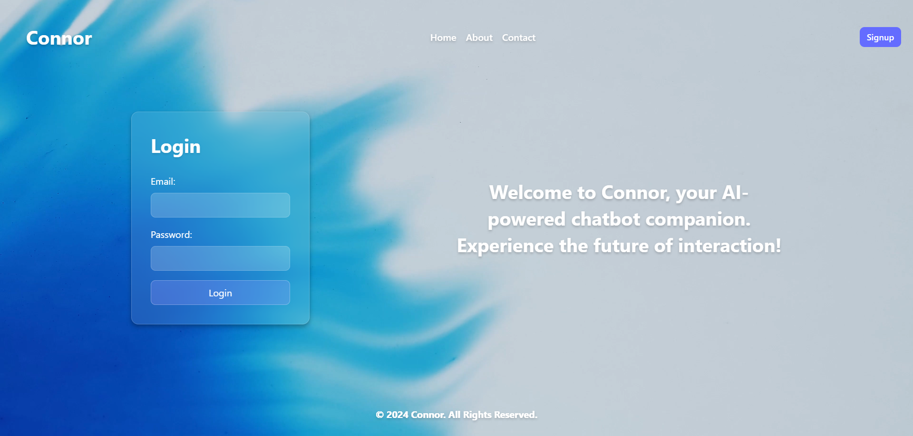
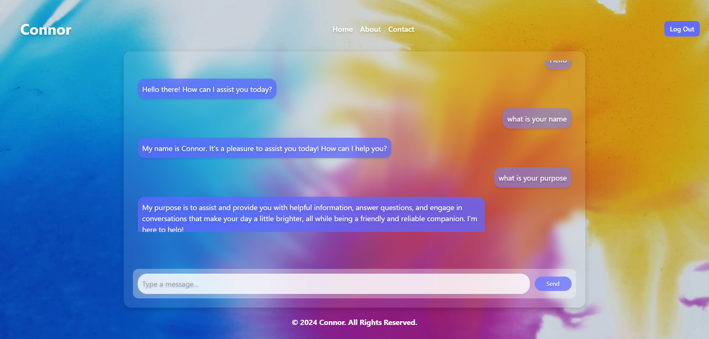

# Connor: A Personalized Chatbot

**Connor** is a minimalist chatbot designed to provide brief and concise responses. Built with the **MERN stack**, Connor leverages modern web technologies to deliver a seamless user experience.

---

## Features

- **Personalized Responses**: Connor tailors its replies to user inputs for a brief yet effective conversational experience.
- **Secure Chat**: User data is secured with JWT-based authentication.
- **Message History**: Fetch and display past messages for context.
- **Modern Design**: A clean and intuitive interface built with Tailwind CSS.

---

## Tech Stack

- **Frontend**: React + Vite, styled with Tailwind CSS
- **Backend**: Express.js with FastAPI for extended functionality
- **Database**: MongoDB for storing user messages and data
- **Authentication**: JWT for secure user sessions

---

## Getting Started

### Prerequisites

- Node.js (v16 or higher)
- MongoDB (running locally or a cloud instance)
- A terminal or code editor

### Installation

1. **Clone the Repository**:
   ```bash
   git clone https://github.com/yourusername/Connor.git
   cd Connor
   ```

2. **Install Dependencies**:
   ```bash
   # For the backend
   cd backend
   npm install

   # For the frontend
   cd ../frontend
   npm install
   ```

3. **Setup Environment Variables**:
   - Create a `.env` file in the `backend` folder with the following:
     ```env
     MONGO_URI=your_mongo_database_url
     JWT_SECRET=your_jwt_secret
     PORT=5000
     ```

4. **Start the Development Servers**:
   ```bash
   # Start the backend
   cd backend
   npm start

   # Start the frontend
   cd ../frontend
   npm run dev
   ```

   The backend will run on `http://localhost:5000`, and the frontend on `http://localhost:5173`.

---

## Screenshots

1. **Login Interface**
   )

2. **Chat Interface**
   

---

## Future Improvements

- Add voice input and response capabilities.
- Integrate AI-driven natural language processing for enhanced conversations.
- Support multi-language responses.

---

## Contributing

Contributions are welcome! Feel free to open an issue or submit a pull request.

---

## License

This project is licensed under the [MIT License](LICENSE).

---


